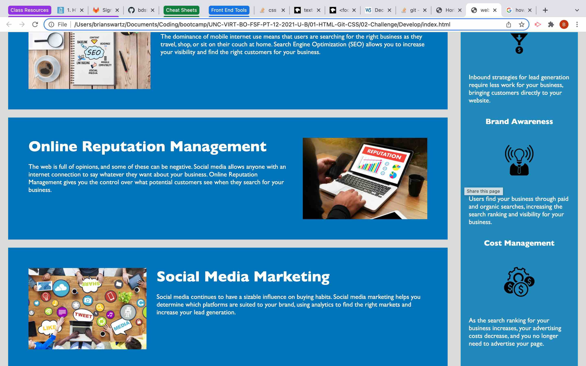

# horiseon-refactor

01/07/2022 
We were tasked with refactoring a web site for accessability and search engine optimization purposes.  A summary of improvments include the following:
-  Renamed elements to follow semantic HTML standards.
-  Provided alternate descriptions for all content images.  Aside images were provided with an empty alternate description to convey that they are decorative images and provide now content to the website.
-  Consolidated styling in the css file that was repeated
-  Changed the h3 in the footer to h4 to emphasize that it is not at the same level of importance as a content article or an aside article.

See screen shots below

Deployed web site address - https://bdswartz.github.io/horiseon-refactor/
